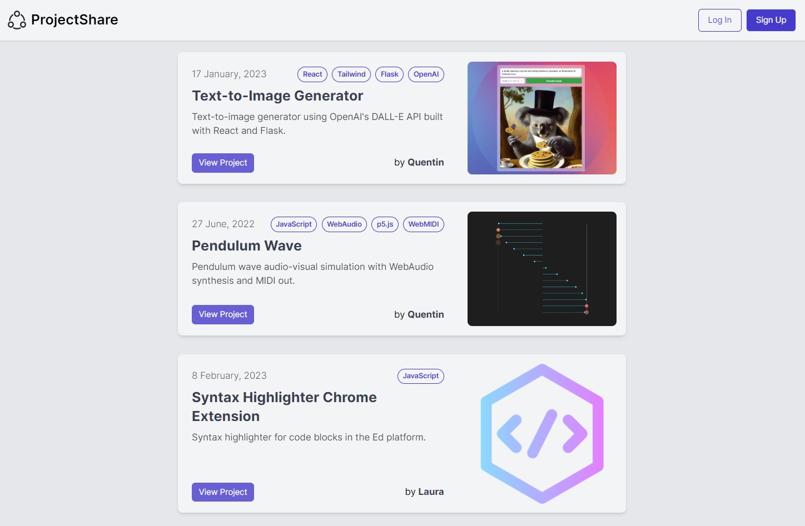
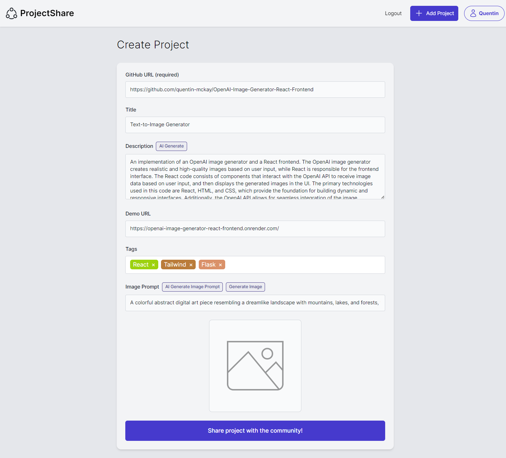
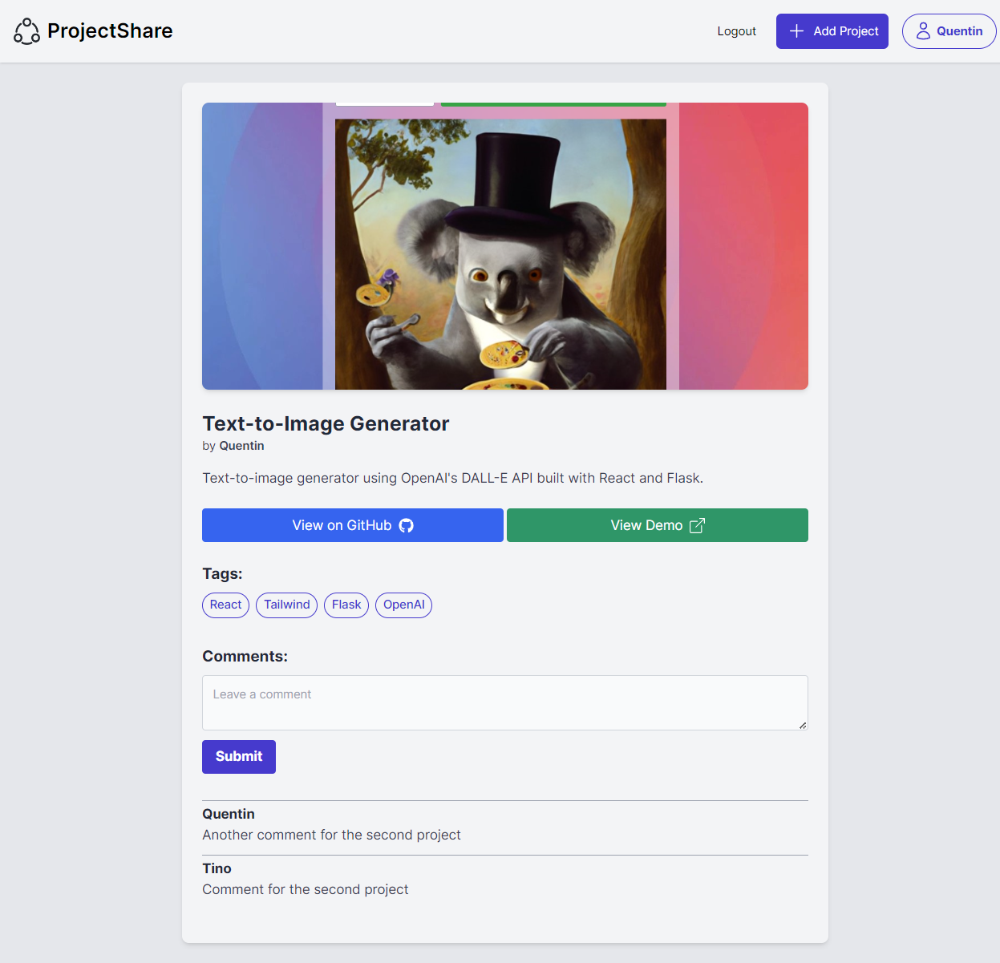
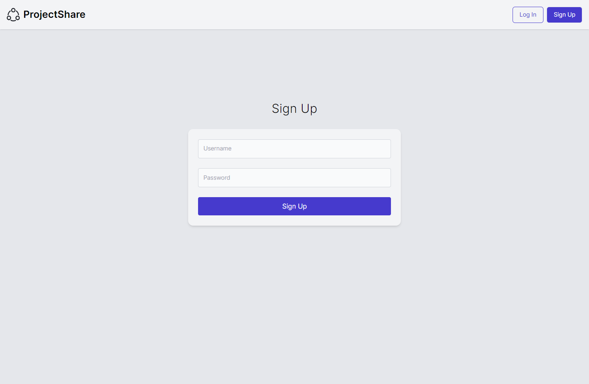
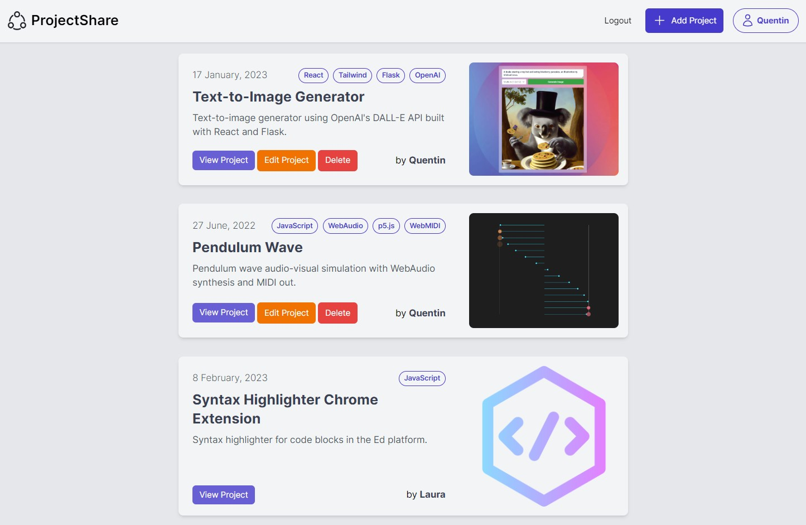

# ProjectShare

A full-stack web application that allows developers to easily browse and share GitHub projects. 

- uses OpenAI's GPT and DALL-E text and image generation APIs to streamline sharing projects.

- implements full-stack JWT user authentication, project tagging/filtering, and a comment system.

<a href="https://projectshare-frontend-react.onrender.com/">View Live Project</a>

 Note: projects can take a few seconds to show up the first time as the backend "wakes up"

[View Frontend React Repository](https://github.com/quentin-mckay/ProjectShare-Frontend-React)

[View Backend Flask Repository](https://github.com/quentin-mckay/ProjectShare-Backend-Flask)

<!-- 

	<a href="https://github.com/quentin-mckay/ProjectShare-Frontend-React">View React Frontend</a>
	<a href="https://github.com/quentin-mckay/ProjectShare-Backend-Flask">View Flask Backend</a>

 -->

## Tech Used

**Frontend**

- React v18
- React Router v6
- React Context API (for managing global auth state)
- Axios (for data fetching)
- Framer Motion (for page transitions)
- Tailwind CSS (for all styles)

**Backend**

- Flask
- PostgreSQL
- Flask-SQLAlchemy (ORM)
- OpenAI ChatGPT API (model gpt-3.5-turbo)
- Cloudinary API (image storage/retrieval)

**Tools**

- Vite (build)
- Render (deployment)

## Features

**Full-Stack Authentication**

- Only users who have signed up or logged in can post new projects.

- Logged in users see Edit/Delete buttons on only their projects.

- Logged in users see a button with their name in the upper right that can be clicked to show their projects

**OpenAI Integration**

- When posting a project, users can click a button to have ChatGPT auto-fill the project description using just the GitHub repository link. The first sentence of the description will be seen on the project card but the entire description is visible on the project page.

- Users can also generate a cover image for their project by prompting OpenAI's DALL-E text-to-image generator (or let ChatGPT auto-generate a prompt). Images are stored using Cloudinary, a media management platform.

**Tag System**

- Users can enter tags for their project (uses a 3rd party package called )

- These tags can then be clicked (either on the project card or project page) to show only projects which have that tag.

**User Filtering**

- Clicking on a project author's name (either on the project card or project page) will show only projects by that author.

**Comment System**

- Users can leave comments on other people projects.

**Smooth Page Transitions**

- Framer Motion was used to create subtle fades between pages.

